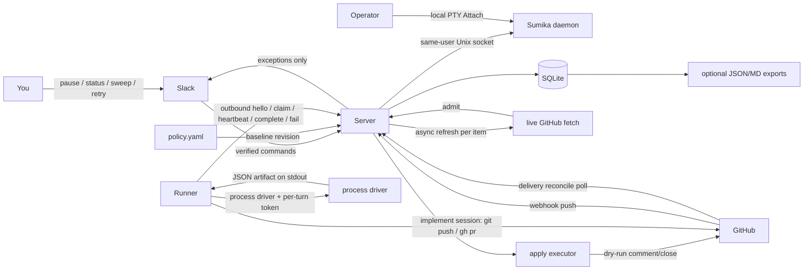
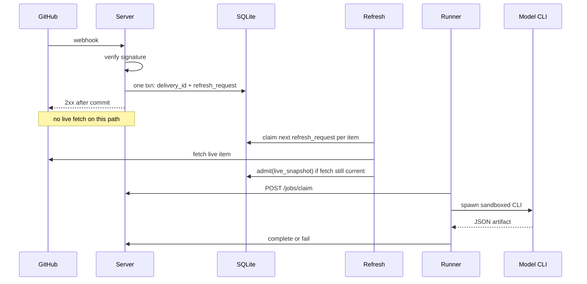

# Rusui architecture

> Product contract. Operator how-to: [docs/operator.md](docs/operator.md).
> Flags and env: [docs/configuration.md](docs/configuration.md).
> Nouns: [CONTEXT.md](CONTEXT.md).
> [VISION.md](VISION.md) and [ROADMAP.md](ROADMAP.md) are sequencing, not this
> contract.

Self-hosted environment plane (留守居: the steward who keeps house while
you are away). You write structured policy. The server admits work onto
typed records — environment, session, turn, runner, event, action —
records immutable review revisions, and dry-runs apply for comment and
close. In `implement` sessions the agent pushes and opens its own pull
requests with the operator's GitHub credential
([ADR 0015](docs/decisions/0015-agent-publication.md)).
GitHub review is the first session kind, not the identity of the system.

This is not ClawSweeper, Tatara, or a Kafka fleet. GitHub is intake. The
server is the source of truth. Slack is the human socket. Model CLIs receive a
GitHub write credential only in `implement` sessions (ADR 0015). Schema changes are versioned migrations
(`schema_migrations`), not `CREATE IF NOT EXISTS` drift.

## Milestones

**Current contract:** one repository profile, one model CLI, signed GitHub
intake, claim/lease on a **turn**, immutable review artifacts in SQLite,
deterministic **dry-run** apply for comment and close, pause/status/retry/cancel,
daily review budget, a per-project concurrent-lease meter
([ADR 0011](docs/decisions/0011-unattended-session-contract.md)), and
agent-driven publication
([ADR 0015](docs/decisions/0015-agent-publication.md)). An `implement`
session of a bound repository receives the operator's GitHub credential;
the agent pushes a branch and opens or updates its pull request with
`git` and `gh`. No proof or independent review gates publication. Commits
carry `Co-authored-by: rusui` and `Rusui-Session` trailers. Human merge is
required. Merge, comment, close, and land stay unauthorized by contract;
token scope and branch protection enforce that line. The domain nouns
are the environment-plane set from
[ADR 0001](docs/decisions/0001-environment-plane.md).

**Live apply (later):** comment, then close, enabled one at a time only
after recovery tests **and** a recorded review-quality evaluation against
operator judgments. Model `confidence = high` is not the promotion
criterion.

**Land (later):** a review of the published PR `head_sha` with a
land-eligible verdict plus policy `land: true`. Never CI green alone.

## Experimental local-interactive profile

[ADR 0016](docs/decisions/0016-local-interactive-runtime.md) accepts the
ownership boundary for the experimental local-interactive profile. Issue #183
adds durable Process and Attach observation records plus an additive session
detail API. Issue #184 adds an explicitly configured, same-user Sumika
adapter. Issue #185 implements the operator-facing unified attach client:
local PTY bytes stay on the Sumika socket, while managed sessions keep the
existing console terminal lease and audit path.

`local` is default-off and can be enabled only on a Project that defines a
`local_runtime` profile with exact argv and clean absolute cwd. An
authenticated create request names only `kind: local`; it cannot override
either value. Rusui reserves the durable Session before asking Sumika to start
`rusui-<session id>`. Each Process generation records a fingerprint of the
argv and cwd used at start, so policy edits do not change the identity of a
running generation. Sumika responses are accepted only when name and identity
match. A mismatch is recorded as lost and is never attached to or killed.
Daemon loss makes observations unknown; a successful List that confirms
absence records lost. Restart is explicit. Cancellation intent is durable and
remains unconfirmed until Sumika reports dead. An explicit restart after a
generation becomes lost starts a new generation without resolving that prior
cancellation intent.
Disabling the local kind prevents new starts while existing Process records
remain reconcilable and cancellable by their generation fingerprints.
Cancellation first sends SIGTERM. After the 30-second grace period, the next
reconciliation sends SIGKILL if Sumika still reports the Process alive, then
keeps observing until death is confirmed. Periodic reconciliation can delay
escalation until its next run.

A local session creates no Turn, lease, retry budget, managed credential, or
model proxy grant.
Rusui owns its Project, durable Session, Environment record, policy, events,
receipts, and versioned Process and Attach observation records. Each Process
generation and each Attach generation has its own Rusui identity and revision;
these records preserve observations, while Sumika remains authoritative for
the live Process and exclusive Attach. An unknown Process blocks another start
until Sumika confirms it is dead or lost. Rusui exposes these records separately
from Turns and Environment state without exposing PTY bytes. Sumika's optional
project value is display grouping only and does not participate in policy
decisions.

Rusui uses Sumika's same-host Unix socket for Start, List, Attach, and Kill.
Attach streams remain raw PTY connections and are not persisted by Rusui.
Startup and a one-minute reconciliation cadence update Process observations
and report orphan `rusui-` names without killing them. This profile supports
macOS and Linux against the Sumika source baseline recorded on issue #184.

The local Environment identifies the operator's host, not an isolated
container or VM; multiple local sessions may share that host. The Process runs
with the Sumika daemon's OS identity and inherited environment and may access
same-user CLI authentication. Rusui injects no managed credential into it.
This is an experimental trust profile outside the managed guest's
credential and machine-isolation guarantees. The integration uses Sumika's
same-host, same-user socket only; remote pairing is out of scope.

The managed runner, container, terminal write lease, and ACP editor contracts
remain unchanged. The local profile is not part of the supported 1.0 core
unless [#141](https://github.com/Sannrox/rusui/issues/141) explicitly includes
it. Issues #183 and #184 established the observation API and runtime adapter;
#185 provides the unified attach client, and #186 owns the cross-profile
evidence.

## System



## Reachability

The HTTP server **defaults** to loopback (`127.0.0.1:8080`). That default
is not a network jail: `-addr` may bind any address, and
`-addr 0.0.0.0:8080` listens on every interface with no TLS. GitHub and
Slack cannot reach loopback by themselves. The operator must run a
separate tunnel or webhook relay (for example smee, cloudflared, or a
GitHub App forwarder) that terminates TLS off-box and forwards to the
listen address.

The tunnel is operator infrastructure, not part of this repo. Forward
GitHub to `POST /hooks/github` and Slack to `POST /hooks/slack` as in
[docs/operator.md](docs/operator.md). If the tunnel is down, refresh of
locally tracked items and delivery reconcile still recover missed work.

Later operator reachability (M4) replaces loopback-as-security with an
**operator** credential plus identity-aware proxy or tailnet. Worker and
turn secrets are not browser sessions. Previews use a different origin.
See [ADR 0003](docs/decisions/0003-operator-surface.md) and
[ADR 0012](docs/decisions/0012-operator-access.md). This milestone still
defaults to loopback; console HTML stays disabled until
`RUSUI_OPERATOR_TOKEN` is implemented.

## Executable policy

Prose is not executable. `policy.yaml` is the only baseline that can
authorize work. Optional `plan.md` notes are ignored by admit/apply.
Policy v2 is keyed by **project** ([ADR 0005](docs/decisions/0005-policy-v2-project.md)).
The shipped parser accepts version 2 only; version 1 files fail closed.

```yaml
version: 2
defaults:
  never_release: true
  never_leak_private_to_public: true
  session_kinds: [review, run, scheduled]
  egress: trusted
projects:
  rusui:
    repos:
      Sannrox/rusui:
        visibility: public
        review: true
        comments: false
        close: false
        implement: false
        land: false
        max_reviews_per_repo_per_utc_day: 50
    session_kinds: [review, run, scheduled]
    egress: trusted
```

Unknown fields fail closed. Missing project slugs mean the project is
out of scope. A GitHub repository not bound to a project in the current
revision is out of scope. Boolean GitHub capabilities default to
`false` except `review`, which defaults to `true` when the repository
is listed under a project.

`comments` and `close` authorize **simulation**, not live GitHub writes.
`land` remains unauthorized. `implement` lets pinned implementation tasks
on the repository run as implement sessions that hold the operator's
GitHub credential, so the agent can push and open or update its own pull
request (ADR 0015); it does not authorize comment, close, or merge. Tests that need an
eligible dry-run use `policy.fixture.yaml`.
`policy.example.yaml` stays the operator default until the parser ports.

`max_reviews_per_repo_per_utc_day` caps **new review claims** for that
bound repository that UTC day (catch-up and webhook-driven). Exhaustion
is a Slack/log exception; work stays queued. Operator `retry` counts
against the budget. In-flight leases are not cancelled.

`session_kinds` is an allowlist: `review`, `run`, `scheduled`, and the
experimental `local` kind. `local` is never inherited from defaults and
requires a per-project `local_runtime` profile. Request bodies cannot
override its configured argv or cwd. Local work runs as the Sumika daemon's
OS user and is outside the managed runtime's isolation and credential
guarantees. `run` is operator-started. A `review` session requires at least one bound
repository. Permission allow-rules on the project grant matching
`session/request_permission` requests. A live unmatched request **waits**
on the JSON-RPC until allow-once, reject-once, or the execution deadline;
current policy is re-read immediately before allow-once. After the RPC
ends, an inbox `allow` is a record, not a grant. Overlay cannot add an
allow-rule.

Project `budgets` may contain only `max_concurrent_leases` (default 1).
Unknown keys, including token or dollar names, fail closed at parse.
`max_reviews_per_repo_per_utc_day` remains the review-admit cap. Token
and dollar collection sources are unavailable.

### Precedence

Highest wins; later rows cannot turn on a capability a higher row turned
off.

1. **Hard defaults** in code: never release; never give the model a write
   token; never copy private context into a public job.
2. **`policy.yaml` baseline** loaded into SQLite as an immutable
   `policy_revision`.
3. **Durable overlay** in SQLite: `pause` per project or globally.
   Overlay may only **narrow**. It cannot enable comments, close,
   implement, land, a session kind, an egress class, or a permission
   allow-rule if the baseline has them off.
4. **Slack commands** write overlay or enqueue jobs through the same
   admit path. Slack cannot bypass (1)–(3).

Reload (`SIGHUP`, startup, or `reload` command): parse file → new
`policy_revision` if bytes changed → overlay pauses **persist**. If the
new file removes a capability, overlay cannot restore it.

### Pause

`pause` stops **new claims** and **apply** (including dry-run insert).
A review already `leased` may heartbeat, complete, or fail. Pause does
not kill the CLI, does not reset `failed` jobs, and does not by itself
enqueue work. `resume` clears the overlay pause.

Pause is persistent across process restart until `resume`. Pause is not
cancellation.

### Cancel

**Cancel** is a session action ([ADR 0011](docs/decisions/0011-unattended-session-contract.md)).
It sends `session/cancel` if a guest is live, kills the guest process
tree, fails the claimed turn as `cancelled` without another automatic
retry of that revision, and releases the concurrent-lease reserve.
Receipts and the session row remain. The environment stays until idle
expiry. HTTP/CLI shape lands with D2/D3.

### Follow-up

Each follow-up prompt is a durable FIFO turn on the same session. A
second queued follow-up must not overwrite the first. A follow-up during
a live lease does not steal that lease.

### Guest ACP session

The guest ACP `sessionId` is ephemeral. Persist the last id on the plane
session. The next turn in the **same** environment tries `session/load`;
if it fails, `session/new`. Restore-failed is a supported outcome.

### Bind and recheck

Every job stores `policy_revision_id` and overlay generation at admit.
Apply (including dry-run) re-reads **current** policy in the same
SQLite transaction as the intended-action insert. If current policy
denies the action, abort; do not use the admit-time revision to
authorize a write.

## Webhook intake and recovery

GitHub **pushes** to the server. The webhook must not spawn a model and
must not fetch live GitHub state.

GitHub does **not** automatically redeliver failed webhooks. A 2xx means
GitHub will not send that delivery again. GitHub expects a response
within ten seconds. Delivery history is retained about three days.



**Intake transaction:** persist unique `delivery_id` and a coalesced
`refresh_request` for `(repo, item)` taken from the payload identity
(number, kind), not from a live fetch. ACK 2xx only after that commit.
Never treat the payload body as the snapshot.

**Refresh coordinator:** the only writer of pending snapshots. Webhook
refresh, catch-up, `sweep`, and apply-detected drift/invalidation all
enqueue `refresh_request`. Apply **must not** call `admit` on its own
GitHub fetch. Apply may read GitHub to verify evidence; writes of
`pending_revision` go only through this coordinator.

At most one **owner** fetch-and-admit per `(repo, item)`. Taking
ownership increments `refresh_generation`, stores `owner_expires_at`
(now + 2 minutes), and binds the owner to this process. Fetch live
state with a **30 second** timeout, then `admit` only if this
generation is still the owner. If a delivery or another producer
arrives during the fetch, set `needs_another_refresh` on the item; do
not start a second owner. After the owner admits or discards, if
`needs_another_refresh` is set, enqueue a new request (new generation).

A fetch whose generation is no longer owner has **expired ownership**.
It must discard its result. The reverse-order test is this case: B
became owner and admitted; A's later completion is expired ownership,
not a second concurrent owner.

**Ownership recovery**

- Fetch timeout (30s) or owner deadline (2 min) without admit:
  the refresh reaper (and process startup) expire ownership, increment
  `refresh_retry_count`, and requeue with exponential backoff
  (1s, 2s, 4s, … cap 60s). After 5 fetch retries: request `failed`,
  Slack/log, do not block other items.
- v1 is a single process: on startup, every in-flight owner is
  expired and requeued (crash recovery). A hung fetch is cancelled
  when its context hits 30s; if it still does not return, the reaper
  expires ownership at `owner_expires_at` so the item is not blocked
  forever.
- Late results after expiry are discarded.

Test: A starts as owner (old GitHub); ownership expires and B admits
new state; A completes → A discarded; pending stays B.

**Recovery (required in v1; after the first fake-GitHub slice):**

Use a **repository webhook** (events: `issues`, `pull_request`,
`issue_comment`). Inbound POST verifies `X-Hub-Signature-256`.
A delivery that parses to `(repo, item)` wakes the **review** session
for that bound item ([ADR 0006](docs/decisions/0006-session-start.md));
duplicate `delivery_id` is a no-op. Payloads with no item do not start
a session. Named schedules and `rusui run` are the other start paths.
Reconcile uses an installation or PAT with `read:org`/`admin:repo_hook`
as configured; the fake GitHub must implement the same two endpoints:

- `GET /repos/{owner}/{repo}/hooks/{hook_id}/deliveries` (list;
  `cursor` is pagination only)
- `GET /repos/{owner}/{repo}/hooks/{hook_id}/deliveries/{delivery_id}`
  (detail; this body contains `event`, `payload`, `delivered_at`)

A list row is not a `refresh_request`. Resolve identity from the
**detail** payload (`issues` / `pull_request` number and kind). Store a
reconcile checkpoint
`(repo, last_processed_delivered_at, last_processed_delivery_id)`.
Advance the checkpoint for a delivery only after a successful detail
fetch **and** the `refresh_request` commit. If detail fetch fails, do
not advance; retry with the same backoff. After 5 failures for that
`delivery_id`, record `failed_delivery` and skip only that id so one
poison delivery cannot stall the repo.

Open-item catch-up is not enough. Also enqueue `refresh_request` for
every **locally tracked** item that is not terminal locally
(`queued` / `leased` / `failed` jobs, unpublished apply, or latest
review of an item still referenced). An item closed during an outage
longer than webhook retention must still be fetched by number and
admitted (closed state is a content change).

Duplicate `delivery_id` is a committed no-op.

The process runs these paths at startup (`Engine.Recover`) and on a
cadence: refresh reaper and `StepRefresh` every second, delivery
reconcile every 5 minutes, open-item and locally-tracked catch-up every
15 minutes, and apply-attempt retry every minute. When
`RUSUI_GITHUB_HOOK_IDS` is unset, reconcile is skipped with a log
reason and does not fail the scheduler.

### Admission

Admission compares the freshly fetched **item** snapshot hash to the
**pending** snapshot (see Snapshot hash). It never uses a stale fetch
(see `refresh_generation`).

- hash == pending snapshot → no-op. Do not increment `pending_revision`.
- no pending snapshot and hash == last published review → already
  current; no job.
- hash differs from pending (or there is no pending and it differs
  from the last review) → persist the new snapshot, increment
  `pending_revision`, `retry_count = 0`; if `state != leased` then
  `state = queued` (including while paused; claim refuses until
  resume). If `state = leased`, leave it leased so heartbeat/complete
  of the in-flight generation still succeed; `claimed_revision` may
  now be behind pending.
- `force` from a durable evidence invalidation → same as content
  change even if item hash is unchanged, persist new `main_sha`,
  reset `retry_count`. Consumed once (see Apply).

Retries of unchanged content are new **attempts** of the same
`pending_revision`. Catch-up during a review of an unchanged item must
not make the runner finish behind pending.

## Lease state machine

Identity: a **turn** (`turns.id`) on a **session**. A session belongs
to one project and one environment ([ADR 0006](docs/decisions/0006-session-start.md)).
**review** identity is `(project, bound repo, item)` — GitHub item
numbers are source attributes, not the lease key. **run** and
**scheduled** identities are minted at create. `lane` on the turn is
`review` / `apply` / `implement`. A lease belongs to one turn, so a live
lease on session A cannot block claiming session B.

| Field | Meaning |
|---|---|
| `pending_revision` | monotonic; latest admitted snapshot |
| `claimed_revision` | snapshot the live runner is executing |
| `lease_generation` | monotonic; increments on every claim, expire, or steal-deny |
| `lease_expires_at` | liveness timeout; heartbeat may extend only while leased and unexpired |
| `execution_deadline_at` | hard cap from claim; heartbeats do not extend it |
| `retry_count` | failed or expired attempts of the **current** `pending_revision` |
| `state` | `queued` / `leased` / `completed` / `failed` |

Completion receipts are stored by
`(turn_id, lease_generation, claimed_revision)` (column `job_id` on
`receipts` is the turn id) and are looked up **before** reading turn state.

```text
admit(live_snapshot, force=false)
  require this refresh_generation is still the owner
  if force: require and consume a pending evidence_invalidation
      for this item (unique key; no-op if already consumed)
  if not force AND pending exists AND hash(live) == hash(pending): no-op
  else if not force AND no pending AND last review exists
       AND hash(live) == hash(last review): no-op
  else:
      persist snapshot; pending_revision += 1
      retry_count = 0
      if state != leased:
          state = queued   // paused included; claim refuses until resume
      // leased: keep leased; claimed_revision may be < pending

expire_lease  (shared; claim and reaper use the same txn)
  require state = leased AND (now > expires_at
      OR now > execution_deadline_at)
  if claimed_revision == pending_revision:
      retry_count += 1
  lease_generation += 1
  if claimed_revision == pending_revision
     AND retry_count >= retry_limit:
      state = failed; Slack exception
  else:
      state = queued
  do not issue a new lease in this function

claim
  in one txn:
    if paused: reject
    if session project missing from current policy
        OR (review session AND bound repo missing or review == false): reject
        (job stays queued; in-flight leases may still complete/fail)
    if daily review budget exhausted: reject (job stays queued)
    if state = leased AND (expired or past deadline): expire_lease
    if state = failed: reject
    require state = queued
    lease_generation += 1
    claimed_revision = pending_revision
    state = leased
    expires_at = now + heartbeat_timeout
    execution_deadline_at = now + execution_deadline
    increment daily review counter

operator_retry(job)   // Slack retry; unchanged revision only
  require state = failed
  insert audit (actor, ts, pending_revision, previous retry_count)
  retry_count = 0
  state = queued
  do not delete receipts or review rows
  // New content already reset the budget via admit; retry is not
  // required and must not run if state is no longer failed.

heartbeat
  require state = leased AND generation match AND now < expires_at
      AND now < execution_deadline_at
  otherwise reject
  extend expires_at only

complete / fail
  // All acceptance is inside finalize_* (one SQLite transaction).
  // Unreceipted stale or expired completions are rejected, not stored
  // as history.
```

`retry_count` is a budget **per snapshot revision**, default
`retry_limit` 3. Writers: `expire_lease` and `finalize_failure`, only
when `claimed_revision == pending_revision`. Admitting a new
`pending_revision` or `operator_retry` resets `retry_count` to 0.
Replaying an old failure receipt does not increment the counter.

`sweep` enqueues refresh_requests. It does **not** reset `failed`
jobs on an **unchanged** revision. After fixing credentials or the
CLI, the operator must `retry`. New content via `admit` already
resets `retry_count` and requeues if the job was failed.

The runner kills the CLI process group when `execution_deadline_at`
hits, even if heartbeats still succeed.

**Concurrency**

- At most one in-flight refresh per `(repo, item)` (session source).
- Review and apply: at most one live lease per turn.
- Implement (later): at most one live implement lease per session, and at
  most one live implement lease per environment.

v1 timeouts: heartbeat every 60 seconds, liveness 3 minutes without
heartbeat, execution deadline 12 minutes from claim, retry limit 3.

## Process boundary

v1 is **trusted local execution** on the operator's machine. The model
child runs as the same OS user. An ephemeral cwd and stripped
environment are defense in depth. They do **not** prevent reading
SQLite, `policy.yaml`, or other repos by absolute path. Public-context
confidentiality in v1 is therefore `PublicContext` plus "do not put
secrets in the workspace," not a filesystem jail.

A separate OS identity or CLI sandbox is v2. OS network jail is also
deferred.

What v1 does enforce:

- GitHub **write** tokens, Slack secrets, and the database stay in the
  **server** process. They are never copied into the job workspace or
  the child environment.
- The model child gets an env allowlist, ephemeral cwd, and isolated
  CLI home. P1 containers do **not** receive a GitHub or xAI secret;
  they receive only the per-turn grant
  ([ADR 0009](docs/decisions/0009-credential-broker.md)).
- Runner hello and claim require the bootstrap secret. Heartbeat,
  complete, and fail accept that secret or the per-turn token.
  The process driver environment contains only an allowlist and
  `RUSUI_TURN_TOKEN` (32 random bytes, hashed at rest, ten-minute
  TTL). `complete`/`fail` include `lease_generation` and
  `claimed_revision`. The runner opens no inbound port.

Only `implement` sessions receive a GitHub write credential, the
operator's own, scoped where it is issued
([ADR 0015](docs/decisions/0015-agent-publication.md)).

A run turn completes only with a structured result. The runner gives the
guest `RUSUI_RESULT`, a file for one JSON object: `{"pull_request": N}`
or `{"blocked_reason": "..."}`. Prose is not a result; a turn without
one fails closed. The runner adds the workspace `HEAD` it observes as
the candidate SHA. On `complete` the plane discards any outcome in the
payload and records its own: `published` only when the read-only GitHub
client shows pull request N in the turn's repository at that candidate
SHA, `unconfirmed` for any other claimed pull request, `blocked` for a
reported reason. The outcome is a record, not a proof or a merge gate.

`internal/acp` is the host-side Agent Client Protocol client. The plane
names the guest per turn (`RUSUI_GUEST`,
[ADR 0017](docs/decisions/0017-claude-guest-and-model-upstream.md)): Grok
(default) spawns `agent --permission-mode default agent stdio`; Claude
Code spawns the `claude-agent-acp` adapter (pinned 0.81.1).
Every inbound `fs/*`, `terminal/*`, and `session/request_permission`
is recorded as an `actions` row. Permission requests with no matching
rule are denied and stored as approvals. The process driver is still
the review lane; the runner does not spawn this client yet.

P1 isolation is two fences ([ADR 0008](docs/decisions/0008-p1-isolation-split.md)).
**Machine isolation** is the container environment (process driver is
test/dev only). **Tool fence** is the guest's default permission mode
plus those permission receipts. Rusui does not jail tools inside the
guest; shikigami’s tool sandbox is out of P1. `--always-approve` is
not the unattended spawn.

Credentials ([ADR 0009](docs/decisions/0009-credential-broker.md)):
git smart-HTTP and model egress proxies run on the **plane**. The
guest holds only the per-turn grant (Grok's `XAI_API_KEY`, Claude Code's
`ANTHROPIC_AUTH_TOKEN`, and git HTTP auth are that grant). The guest is
pointed at the plane model proxy (`GROK_XAI_API_BASE_URL` or
`ANTHROPIC_BASE_URL`); the runner **execs** it inside the container.
Claude Code runs with a fresh `CLAUDE_CONFIG_DIR`, never the operator's
login. Guest egress
`trusted` is plane proxies only. GitHub REST stays on the plane.
Missing App key or xAI key fails closed. A plane CA lives in the guest
image. Snapshot prepare uses a read-only grant through the same git
proxy.

Environments have a create / sleep / wake / expire lifecycle. Drivers
implement the same interface: `process` (a workspace directory) and
`container` (Docker/Podman-compatible runtime). **One session, one
environment.** The default `local` environment is not a P1 dogfood
environment and is not shared across review sessions.

A **snapshot** is the prepared tree for a `source_hash`: digest of
base image identity, git pin, and `.agents/setup` bytes if present
([ADR 0007](docs/decisions/0007-environment-snapshot.md)). P1 requires
a git pin (PR head for pulls; default-branch SHA at admit for issues;
bound-repo default branch for `run` / `scheduled`). On miss, the
runner clones, runs `.agents/setup` if present, and caches the
snapshot locally under that hash. On hit, the session environment is
created from the cache with no setup. Wake runs `.agents/resume` only.
The plane stores the hash string, not the bytes.

Idle 72 hours from last wake or last turn end expires the environment.
The session row stays; the next turn re-materializes from the
snapshot. A new git pin on a live session replaces the environment
for that turn. Sleep/wake on a live environment keeps in-container
dirt.

## Review artifacts

Canonical review JSON lives in SQLite on the `review_revisions` row,
committed in the same transaction as the completion receipt and job
transition. Optional `records/.../r{id}.json` and `.md` files are
**exports** regenerated from SQLite. They are not the executor input
and are not required for recovery.

Each accepted `/complete` inserts an **immutable** review revision.
Apply stores `review_revision_id` and never reads a superseded row.

**Process driver:** `rusui-runner` execs `-driver` in an ephemeral
cwd. The driver prints a review artifact as JSON on stdout. There
is no `input.v1.json` / `output.v1.json` contract.

**Input (versioned, server-built, pinned):** the model may reason
only over this blob. It must not call live GitHub for the item.
`PublicContext` plus:

- claim identity: `repo`, `item`, `item_kind`, `claimed_revision`,
  `item_hash`, `snapshot_hash`
- `main_sha` from the **admitted snapshot** for `claimed_revision`
  (refresh/admit time). Claim does not re-fetch default branch.
- issue/PR title and body, truncated at 64 KiB with a `truncated`
  flag
- last 50 comments, 32 KiB total, truncated oldest-first
- for PRs: patch of `base_sha...head_sha` from the snapshot, max
  256 KiB; if larger, omit hunks and include `patch_sha256` of the
  full patch
- labels, state, linked same-repo items from the snapshot

Repository reads that the adapter performs (if any) must use
`head_sha` / `main_sha` from that snapshot, not `HEAD` of a moving
branch. A model that returns the correct `snapshot_hash` while
having fetched newer live content is out of contract; the fake
GitHub in tests serves only the pinned snapshot.

**Output:** `output.v1.json` matching the artifact fields below.

`main_sha` on the stored review row is copied from the claimed
snapshot (admission), not from a claim-time fetch.

The runner sends the model JSON. The server **validates and overlays
server-owned claim data** before finalize:

Must equal the lease/snapshot row (else `/complete` is rejected as
fail-without-publish, or the runner should `/fail`):

- `repo`, `item`, `item_kind`
- `claimed_revision`, `snapshot_hash`
- `head_sha` / `base_sha` for PRs (empty for issues)

`main_sha` in the model output is ignored. The server stores
`main_sha` from the claimed snapshot (set at admit).

**Evidence classes**

| Class | Who records it | May authorize dry-run close? |
|---|---|---|
| `server_verified` | server, via GitHub API using claim identity | yes, if the reason allows |
| `model_assertion` | model only (path, narrative, claimed command) | no |

A source path or "command succeeded" digest from the model is
`model_assertion`. It is stored, never treated as proof.

Allowed `(verdict, action, reason)` triples; anything else is
malformed (`/complete` → `finalize_failure` semantics: no apply):

| verdict | action | reason_code | v1 dry-run |
|---|---|---|---|
| `keep` | none | — | no |
| `propose_comment` | comment | (any listed reason or `note`) | if `comments` and `server_verified` or comment-only assertion |
| `propose_close` | close | `implemented_on_main` | if `close` and server verifies the cited merge commit or commit SHA is an **ancestor of the live default-branch tip**. A PR merged only into a non-default base (for example `release-*`) does not qualify |
| `propose_close` | close | `duplicate_or_superseded` | if `close` and server fetches the canonical same-repo item and it exists |
| `propose_close` | close | `stale_insufficient_info` | if `close` and server-verified: item age ≥ 60 days **and** no non-bot comment in 60 days |
| `propose_close` | close | `not_reproducible_on_main` | **advisory**; never apply in v1 |
| `propose_close` | close | `incoherent` | **advisory**; never apply |
| `propose_implement` | — | — | no (v3) |

`confidence` is recorded. It is **not** sufficient for eligibility.
v1 enqueue dry-run only when the triple is allowed, policy flag is
true, and required `server_verified` checks passed. Tests load
`policy.fixture.yaml` when they need `comments`/`close`.

Dry-run output (and the stored intended-action) must label each
proposed action with evidence class and a one-line limit, for example:

- `implemented_on_main`: server verified the cited PR/commit is on
  default branch; **not** that it solves the reported problem
- `duplicate_or_superseded`: server verified the canonical same-repo
  item exists; **not** that the reports are duplicates
- `stale_insufficient_info`: server verified the 60/60 day thresholds
- `model_assertion` / advisory reasons: not eligible to apply

`/complete` and `/fail` run **one** SQLite transaction each. Receipt
lookup, liveness, identity, and state transition all happen there.
GitHub evidence checks for apply eligibility may run **before** the
transaction; the transaction re-checks liveness. If the lease is dead
at commit time, reject: no review row, no receipt.

**Acceptance (both finalize paths), inside the transaction:**

1. Lookup receipt `(job_id, lease_generation, claimed_revision)`.
   If present: return it. Stop.
2. Require `state = leased` AND generation match AND
   `claimed_revision` match AND `now < expires_at` AND
   `now < execution_deadline_at`.
3. Else **reject**. Unreceipted stale or expired completions are not
   stored as history.

`finalize_completion` after acceptance:

- Validate artifact identity against the claim row (no network).
  Mismatch → do not insert a review; instead take the
  `finalize_failure` branch in this same request (failure receipt).
- Insert `review_revisions` with canonical JSON blob.
- Insert completion receipt (`kind=complete`).
- If `claimed_revision == pending_revision`: `state = completed`;
  enqueue dry-run apply only if eligible.
- If `claimed_revision < pending_revision`: `state = queued` for
  pending; no apply. (Pause does not block this complete.)
- Do not accept a generation that is not the live lease (step 2).

`finalize_failure` after acceptance:

1. Insert failure receipt (`kind=fail`, no `review_revision_id`).
2. If `claimed_revision < pending_revision`: `state = queued` for
   pending; do **not** increment `retry_count`.
3. If `claimed_revision == pending_revision`: `retry_count += 1`;
   `state = failed` if `retry_count >= retry_limit`, else `queued`
   for the same pending snapshot.
4. No review JSON. No apply. Retrying `/fail` returns the same receipt.

Crash before the transaction commits: no row, no receipt; the runner
retries `/complete` or `/fail` with the same generation.

## Snapshot hash

**Item hash** (admission, catch-up, "unchanged content") — canonical
JSON, SHA-256:

- `repo`, `item`, `item_kind`, `state`, `title`, `body`
- `labels` (sorted), `draft`, `merged`
- `head_sha`, `base_sha` (PRs; empty for issues)
- `updated_at` from GitHub
- `non_bot_comment_count` excluding this app's marker comments
- `linked_same_repo_items` (sorted)

Default-branch `main_sha` is **not** in the item hash. A commit to
default branch does not by itself rereview every open issue.

The server still stores `main_sha` on the snapshot and review row from
the fetch that produced it.

Apply may **read** the item and default-branch SHA to verify evidence.
It must not write pending snapshots. Item-hash mismatch or failed
main evidence is handled only through the apply transaction below
(cancel + enqueue refresh, and invalidation when evidence failed).

For `implemented_on_main`, independently verify default-branch
**reachability**: the cited merge commit or commit SHA is an ancestor
of the live default-branch tip (`git merge-base --is-ancestor` /
GitHub compare). A PR whose `base.ref` is not the repository default
branch, or whose merge commit is not on that tip's history, fails
this check even if GitHub `merged` is true.

If evidence still holds, main advancing is not drift. If it fails,
in **one** SQLite transaction: cancel the attempt, insert
`evidence_invalidation` `(review_revision_id, action_id)` if absent,
and enqueue the force `refresh_request`. `admit` consumes that
invalidation once. A crash after this commit still has the refresh
queued; recovery must not insert a second invalidation or increment
`pending_revision` twice.

Inside apply's **final** SQLite transaction, recheck policy/overlay,
`review.claimed_revision == job.pending_revision`, and item hash
versus pending. If not, cancel without inserting an intended-action.

## Apply (deterministic)

No model. Server-side executor.

Action identity (stable across retries):

```text
action_id = sha256(repo | item | action_type | review_revision_id | target)
```

`target` is the comment marker id, close reason, or PR number.

Attempt states: `planned` → `in_flight` → `succeeded` | `failed` |
`uncertain` | `cancelled`.

```text
insert attempt planned
if paused: cancelled
read item + main_sha  // verify only; not admit
if item hash != review item hash:
    in one txn: cancel attempt; enqueue refresh_request
if reason requires main evidence and server_verified check fails:
    in one txn: cancel attempt;
        insert evidence_invalidation (review_revision_id, action_id)
        if absent;
        enqueue force refresh_request
begin in_flight
in one SQLite transaction:
  re-read current policy + overlay (pause included)
  require review.claimed_revision == pending_revision
  require review item hash == pending item hash
  if denied or mismatch: cancelled; do not insert intended-action
  else: insert intended-action once under action_id; succeeded
```

**v1 reconcile** uses the local intended-action record, not GitHub.
Success means that record exists for `action_id`. GitHub-side outcome
checks are **v2**.

## Review quality

Crash tests prove recording is reliable. They do not prove useful
maintenance decisions.

**v1 eval set:** `eval/set.md` (or JSON) with at least one fixture per
reason_code, plus abstain/`keep`, plus misleading evidence (merged
release-branch PR; canonical item that is not a duplicate). Each row:
item identity, operator judgment (`keep` / `comment` / `close` /
`advisory`), and notes. Run the dry-run path against this set during
v1, **before Slack and before live apply**. Store on each review
revision: evidence class, reason_code, server-limit sentence, and
token/spend fields if the CLI reports them (`input_tokens`,
`output_tokens`, or a USD estimate). Daily review count is not a
spend measurement.

**v2 promotion (per reason, all must hold):**

| reason | promote to live only if |
|---|---|
| `implemented_on_main` | 0 false closes on the eval set; every true close has default-branch reachability |
| `duplicate_or_superseded` | 0 false closes; operator agrees the canonical item is the same report |
| `stale_insufficient_info` | 0 false closes; 60/60 thresholds held |
| `not_reproducible_on_main` / `incoherent` | never live in v2 |
| `propose_comment` | comments judged useful ≥ 2× harmful on the set |

Do not promote because `confidence = high`.

## Publication (ADR 0015)

The agent publishes. In an `implement` session the guest holds the
operator's GitHub credential and runs `git push` and `gh pr create` /
`gh pr edit` itself. The plane only decides which sessions receive the
credential.

An **implement session** is a `run` session started for an open pinned
implementation task (`rusui run -effort … -repo … -ref … -base-sha …
-paths …`) on a bound repository whose policy sets `implement: true`, in a
project that admits `run`. Review, scheduled, and ordinary run sessions,
and sessions whose task was superseded, abandoned, or cancelled, never
receive the credential.

- No `proven` outcome, verifier run, or independent review gates
  publication. Those remain optional evidence.
- Commits carry `Co-authored-by: rusui <noreply@rusui.invalid>` and
  `Rusui-Session: <session>`; operators may disable either with
  `RUSUI_DISABLE_COAUTHOR_TRAILER=1` or `RUSUI_DISABLE_SESSION_TRAILER=1`.
  Trailers are attribution, not authorization.
- The pull request author is the operator. Human merge is required.
  Merge, close, label, protection, and release are unauthorized by
  contract. Use a fine-grained token limited to the bound repositories
  with only contents and pull requests write, and protect the default
  branch: pull requests and status checks required, no force pushes or
  deletion. With more than one maintainer, also require an approving
  review from someone other than the last pusher. A solo maintainer cannot,
  so nothing on GitHub stops the agent from merging with that token; the
  implement-session reject rules ([ADR 0017](docs/decisions/0017-claude-guest-and-model-upstream.md)
  D3) guard against it and are not a security boundary. rusui does not
  verify the profile; the operator owns it.

Existing PRs: land is triggered by a review verdict plus policy
`land: true`, never by CI green alone.

## Slack

Slack is not the bus and not the record store.

Inbound: verify `X-Slack-Signature` over the **raw** body, reject if
`X-Slack-Request-Timestamp` is older than five minutes (replay), then
authorize `user_id` against an allowlist. Fail closed if any check
fails.

Commands: `status`, `pause [project]`, `resume [project]`,
`sweep [repo]`, `retry [repo[#item]]`, `reload`. `implement` is
rejected in Slack; implement sessions start from the CLI or API as pinned
tasks. `pause rusui` names the
project slug, not `Sannrox/rusui`.

`retry` is the only way to requeue `state = failed` on an **unchanged**
revision after the attempt budget is exhausted. It writes an audit row
and resets `retry_count` for the current `pending_revision`.
Historical receipts stay. New content via `admit` already resets the
budget.

Outbound: one exception per stop condition. No transcripts.

If Slack credentials are absent, log exceptions and keep running.
GitHub hooks do not depend on Slack.

## Public output

String denylists are a backstop, not the control.

A public-repo job receives only a `PublicContext` built from that
repo's public GitHub fields. It must not include policy overlay notes,
Slack text, private repo names, or other-repo URLs.

Public GitHub writes (v2+) are rendered only from `publishable` fields
on the review revision plus same-repo public URLs.

## Stop conditions (Slack or log once)

- release, tag, publish
- security, privacy, or product-direction with no safe default
- public output that is not derived from `publishable`
- destructive unique local work
- missing credential or live target
- review retry_limit exhausted (until operator `retry`)
- daily review budget exhausted
- apply `uncertain` that cannot be reconciled

## Non-goals

- Kafka, RabbitMQ, or Redis as the job system
- A multi-tenant GitHub App marketplace or dashboard; automerge as a
  product. One GitHub App for the operator’s dogfood repos is in
  scope ([ADR 0009](docs/decisions/0009-credential-broker.md)).
- Spawning CLIs or live GitHub fetches inside the webhook handler
- Write tokens in the model environment
- A second orchestrator beside this server
- live comment, close, merge, or land; unnamed GitHub writes
- Promoting live apply from model confidence alone
